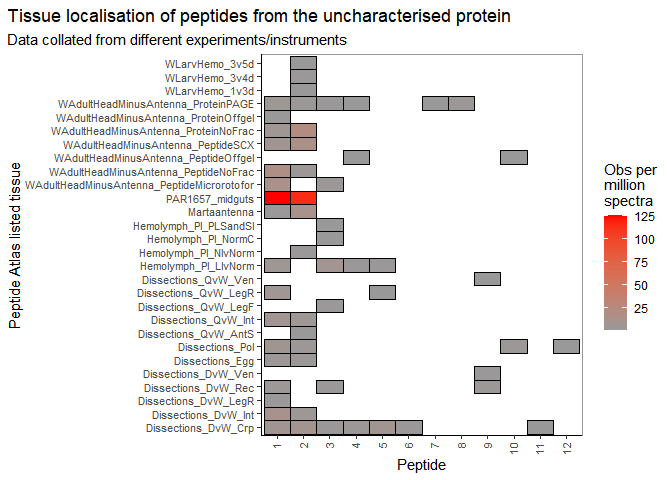

Tissue localisation data via web scraping a public database
================
Blake Paget
2024

- [Background](#background)
- [R script](#r-script)
- [Plot](#plot)
- [Summary](#summary)

## Background

Bioinformatic investigation of an uncharacterised protein found in
honey.<br> Here I’ve used the ‘rvest’ package to scrape the peptide map
data for the uncharacterised protein from the [Peptide
Atlas](https://peptideatlas.org/) website because I could not find any
clear way to export the data from the website. I’ll use a single protein
accession to gather all the peptide accessions and then use these to
access each peptide page which contains the ‘Observed in Experiments’
table with the ‘NObs’ (number of observations per million spectra) field
which quantifies the peptide appearance in each sample/tissue type.<br>
These code chunks can be used to search a list of targets by looping the
protein page scrape. <br> <br> Peptide Atlas uses
[BeeBase](https://hymenoptera.elsiklab.missouri.edu/) (archived) GeneID
numbers based on amel_OGSv3.2 with a ‘-PA’ suffix for proteins.<br> <br>

## R script

#### Load libraries

``` r
library(tidyverse)
library(dotenv)
# Library to scrape pages:
library(rvest)
```

<br>

#### Build protein URL

``` r
# Url sections.
url_builder1 <- "https://db.systemsbiology.net/sbeams/cgi/PeptideAtlas/GetProtein?atlas_build_id=399&protein_name="
url_builder3 <- "&action=QUERY"

# Peptide Atlas accession for uncharacterised protein.
load_dot_env()
PA_protein_id <- Sys.getenv("UP_ACCESSION")
```

<br>

#### Scrape the page

``` r
# Scrape the protein page.
up_page <- read_html(paste0(url_builder1, PA_protein_id, url_builder3))
up_peptide_table <- data.frame(up_page %>% html_element(".PA_sort_table") %>% html_table())

# Unlist the peptides to a vector.
pepatlas_pep_list <- 
  up_peptide_table %>% 
  select(Accession) %>% 
  unlist
```

<br>

#### Build peptide URL

``` r
url_builder4 <- "https://db.systemsbiology.net/sbeams/cgi/PeptideAtlas/GetPeptide?_tab=3&atlas_build_id=399&searchWithinThis=Peptide+Name&searchForThis="
url_builder6 <- "&action=QUERY"
```

<br>

#### Scrape by looping through peptide pages

The desired ‘Observed in Experiments’ table on each page will be
extracted to a list of tables and collapsed.<br> <br>

``` r
pepatlas_data_list <- list()

# Loop over peptides, extract the table data as a separate list for each peptide.
for (i in 1:length(pepatlas_pep_list)) {
  # This loop can take a while if there are lots of peptides. Uncomment the line below to print a progress message.
  #print(paste0("Fetching", i, " of ",  length(pepatlas_pep_list)))
  x <- read_html(paste(url_builder4, pepatlas_pep_list[i], url_builder6, sep = ""))
  y <- data.frame((x %>% html_elements(".PA_sort_table") %>% html_table())[[2]])
  y$Peptide <- rep(pepatlas_pep_list[i], nrow(y))
  pepatlas_data_list[i] <- list(y)
}

# Collapse the lists.
df <- do.call(rbind,pepatlas_data_list)
```

<br>

``` r
# Mask peptides with number.
df <-
  df %>% 
  mutate(pep_mask = as_factor(as.integer(as_factor(Peptide))))
```

## Plot

``` r
ggplot(df, aes(pep_mask, Experiment.Tag)) +
  labs(x = "Peptide",
       y = "Peptide Atlas listed tissue",
       title = "Tissue localisation of peptides from the uncharacterised protein",
       subtitle = "Data collated from different experiments/instruments") +
  scale_fill_gradient(low = "grey60",
                      high = "red",
                      name = "Obs per\nmillion\nspectra") +
  geom_tile(aes(fill = NObs),
            colour = "black",
            width = 1,
            height = 1) +
  theme(axis.text.x = element_text(angle = 90, hjust = 1, vjust = 0.4, size = 8),
        axis.text.y = element_text(size = 8),
        axis.line.x = element_line(color = "black"),
        axis.line.y = element_line(color = "black"),
        panel.grid.major = element_blank(),
        plot.caption.position = "plot",
        plot.caption = element_text(hjust = 0),
        plot.title.position = "plot",
        panel.background = element_blank(),
        panel.border = element_rect(color = "grey60", fill = NA),
        legend.position = "right",
        strip.background = element_rect(color = "grey60", fill = "white"))
```

<!-- --> <br>
<br>

## Summary

This script replicates the observation data found on the searched
protein page of Peptide Atlas. It can be further modified to fetch the
observation data for multiple proteins in one go. The peptide
observations for each protein can be flattened and normalised to allow
comparison of the localisation patterns of multiple proteins.<br> These
data show the uncharacterised protein can be found in the midguts which
correlates with it being found in honey becuase nectar is stored in the
crop which is connected to the midgut. <br> <br> But is the
uncharacterised protein expressed there too?<br>
<br><br><br><br><br><br><br><br><br><br><br><br><br><br> *End of
document*
